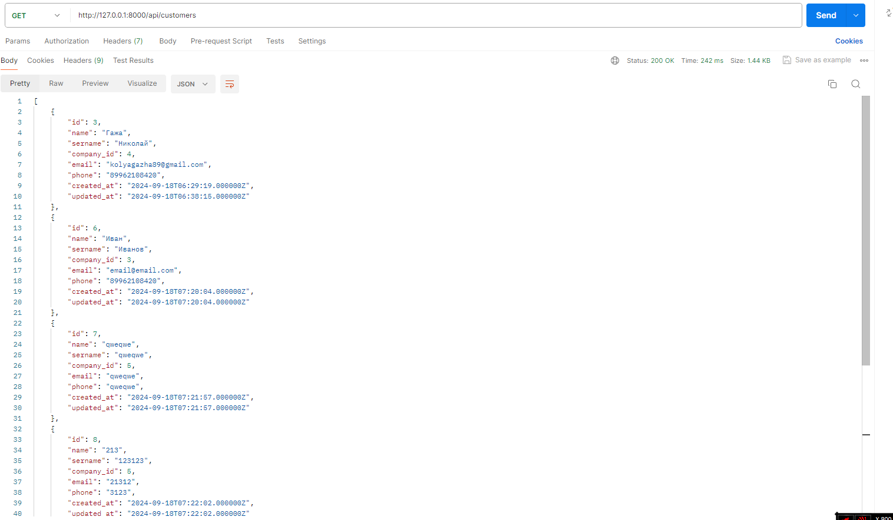

АПИ

Get-запрос для получения всех сотрудников (http://127.0.0.1:8000/api/customers)

Get-запрос для получения определенного сотрудника (http://127.0.0.1:8000/api/customers/3)

Post-запрос для добавления сотрудника (http://127.0.0.1:8000/api/customers/add)

Put-запрос для редактирования сотрудника (http://127.0.0.1:8000/api/customers/update/11)

Delete-запрос для удаления сотрудника (http://127.0.0.1:8000/api/customers/delete/11)